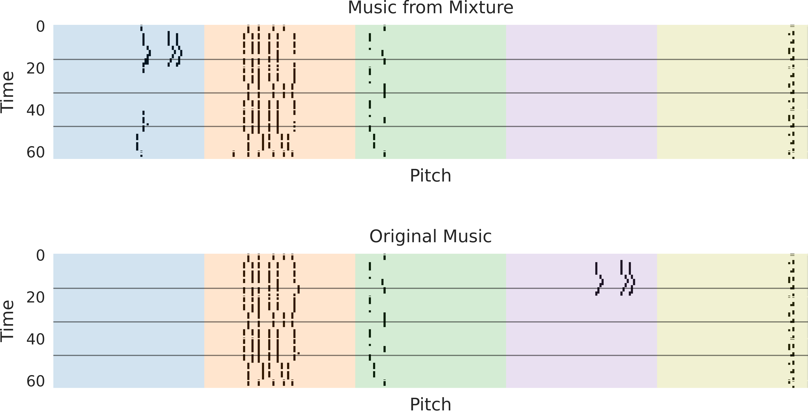

# Mixture2Music Offical

This repository is implementation of "Instrument Separation of Symbolic Music by Explicitly Guided Diffusion Model" (submitted at [NeurIPS ML4CD 2022](https://neuripscreativityworkshop.github.io/2022/)). Our diffusion model takes mixtures <em>(time x pitch)</em> as inputs and recovers music <em>(time x pitch x instrument)</em> with strong consistency.

<p align="center">
    
</p>

## Getting Started

### Environments

* Python 3.8.8
* Ubuntu 20.04.2 LTS
* Read requirements.txt for other Python libraries

### Data Download

* [Lakh MIDI Dataset (LMD-full)](https://colinraffel.com/projects/lmd/)

### Data Preprocess

[preprocess.ipynb](/preprocess.ipynb) is to obtain the pianoroll of mixtures and music pairs from LMD. Although it is originally built to separate melody/non-melody tracks using midi-miner, you can modify it by removing melody-related codes.

### Model Training
You should modify json fields related to file and folder paths in config.json. By setting "strategy" (ex. ddp) and "gpus" (ex. [0, 1, 2]), you can train the models with distributed GPU settings of pytorch-lightining.

For training the diffusion separator based on TransUNet, the command is below;
```
python melody2music_train.py
```

For training the independent decoder, the command is below;
```
python melody2music_decoder.py
```

### Model Inference
You can obtain demo samples from [melody2music_test.ipynb](/melody2music_test.ipynb).

## Samples
You can listen our generated samples on [Google Drive](https://drive.google.com/drive/folders/1E6VNxQgVLZR_FbVMdmGx0WCixwu9i6OA). It consists of sets of (*.png, *_original_music.wav, *_music_from_mixture.wav).

## Appreciation
I have learned a lot from [Lil'Log](https://lilianweng.github.io/posts/2021-07-11-diffusion-models/) and [Huggingface tutorial](https://huggingface.co/blog/annotated-diffusion).

## References
Sangjun Han, Hyeongrae Ihm, DaeHan Ahn, Woohyung Lim (University of Ulsan and LG AI Research), "Instrument Separation of Symbolic Music by Explicitly Guided Diffusion Model"
